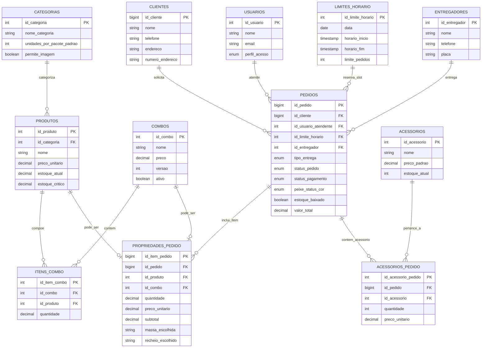

# Diagrama Entidade-Relacionamento (DER) - Doceria Julipe

**Projeto:** Sistema de Gerenciamento Operacional - Doceria Julipe  
**Formato:** Mermaid ER Diagram  

---

## 1. Visão Geral das Entidades e Cardinalidades

O modelo relacional do sistema organiza-se em torno da entidade central **`PEDIDOS`**, integrando:
- **Atendimento e Vendas**: `CLIENTES`, `USUARIOS`
- **Logística e Capacidade**: `LIMITES_HORARIO`, `ENTREGADORES`
- **Catálogo de Ofertas**: `CATEGORIAS`, `PRODUTOS`, `COMBOS`, `ITENS_COMBO`
- **Detalhamento do Pedido**: `PROPRIEDADES_PEDIDO` (Itens/Personalizações), `ACESSORIOS_PEDIDO` (`ACESSORIOS`)
- **Parâmetros de Sistema**: `CONFIGURACOES_SISTEMA`

---

## 2. Diagrama de Relacionamentos (Mermaid)

---

## 3. Explicação das Regras de Integridade Referencial

1. **`PEDIDOS` $\rightarrow$ `PROPRIEDADES_PEDIDO` (`ON DELETE CASCADE`)**:
   - Se um pedido for apagado do sistema, todos os seus itens associados em `propriedades_pedido` serão automaticamente removidos para evitar registros órfãos.
2. **`PEDIDOS` $\rightarrow$ `CLIENTES` (`ON DELETE SET NULL`)**:
   - Se o cadastro de um cliente for removido fisicamente, a coluna `id_cliente` nos pedidos históricos desse cliente é definida como `NULL`, preservando os dados financeiros e o histórico de faturamento da doceria.
3. **`PRODUTOS` $\rightarrow$ `PROPRIEDADES_PEDIDO` (`ON DELETE RESTRICT`)**:
   - Impede a exclusão física de um produto do catálogo se ele já tiver sido vendido em algum pedido. Para tirar o produto de circulação, utiliza-se a exclusão lógica (*Soft Delete*) via `deletado_em` ou desativação via `ativo = FALSE`.
4. **Exclusividade Mutua de Itens (`CHECK`)**:
   - Em `propriedades_pedido`, garante-se que cada linha pertença **exclusivamente a um Produto individual ou a um Combo**, prevenindo inconsistências de dados na comanda da cozinha.
5. **Composição de combos (`UNIQUE` e `ON DELETE RESTRICT`)**:
   - O par (`id_combo`, `id_produto`) é único, impedindo o mesmo produto em duas linhas do combo. Produtos e combos não são removidos fisicamente enquanto houver composição ou referência histórica; o fluxo usa exclusão lógica.
6. **Nome vigente de combo (`UNIQUE INDEX` parcial e funcional)**:
   - `LOWER(TRIM(nome))` é único somente onde `item_ativo = TRUE` e `deletado_em IS NULL`, garantindo concorrência segura e permitindo reutilização após exclusão lógica.
